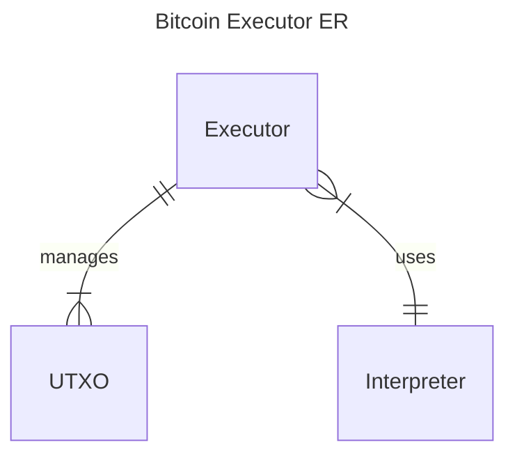
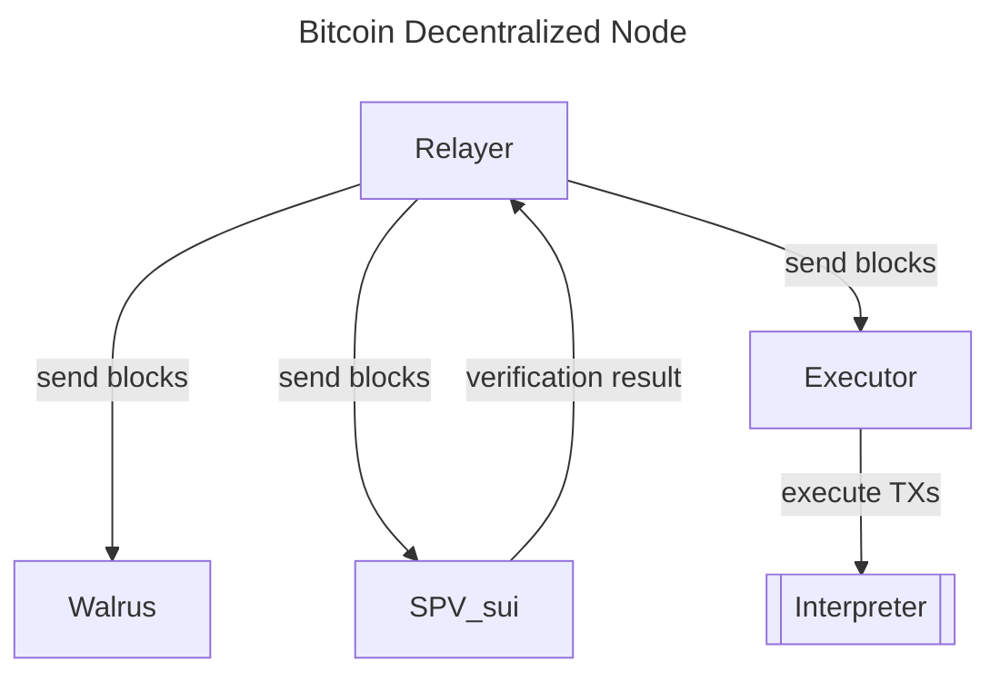
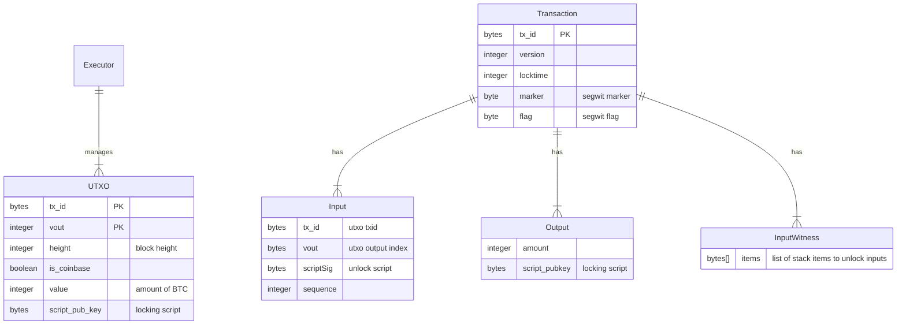

# Bitcoin Executor

Bitcoin Executor is set of Sui packages (smart contract) to process Bitcoin blocks and execute Bitcoin transactions.
It's part of Bitcoin Execution Node powered by Sui and Walrus - it allows to trustlessly and permissionlessly execute Bitcoin on Sui. See Architecture section below for more details.

This project is submitted to the [Kostas May Hackathon](https://x.com/kostascrypto/status/1918879265677819908)

## Architecture

1. Bitcoin [Relayer](https://github.com/gonative-cc/relayer/tree/master/bitcoinspv): Go service listening for new blocks, validating and sending to SPV, Walrus and Executor
2. Bitcoin [Executor](./) (this project): manages UTXO state and executes Bitcoin transactions.
3. [Walrus](https://www.walrus.xyz/): data availability for Bitcoin blocks.
4. Bitcoin [SPV](https://github.com/gonative-cc/move-bitcoin-spv/): light client validating Bitcoin block headers, checking proof of work and managing the heaviest chain.

### Bitcoin Executor

### Overall Architecture

## Flow

1. Relayer listens for _new blocks_.
2. Once a _new block_ arrives, Relayer validates it and checks if it's already processed. If not valid or already processed, `abort`.
   - NOTE: Relayer has internal storage to handle reorgs and query Bitcoin nodes for missing blocks of the _current branch_.
3. Relayer sends block header (or a whole branch if reorg is detected) to SPV to validate if the branch makes a heaviest chain. If not, `abort`.
4. Relayer sends new blocks of the extended branch (based on the SPV result) to Walrus for data availability.
5. Relayer sends new blocks to Executor.
6. Executor parses the block, `abort` if encounter errors.
7. Executor extracts transactions and processes them. For each transaction:
   1. Checks if inputs are existing UTXOs
   2. For each input, call Interpreter to execute Bitcoin script.
   3. If Interpreter returns error (false), `continue` to the next transaction.
   4. Marks UTXOs of a successful TX as spent.
   5. Add outputs of a successful TX to UTXO set.

## TODO

Few things are missing to have a fully functioning trustless implementation of a Bitcoin Execution Node in Sui:

- SPV and Relayer handle reorgs, however the Executor doesn't handle reorgs yet.
  - We need to update UTXO management to handle reorgs: add versioning and cleanups.
- Executor should use SPV to trustlessly verify blocks and independently handle reorgs. We started the integration but didn't have time to test it and finish the setup.
- Bitcoin block size limit is 4MB. This is way more than a Sui TX size limit. We could split Block into multiple PTBs, but then we have another problem -- theoretically Bitcoin transaction size is the size of the block, and TXs have to be handled atomically and operate on an interpreter stack.
  - Today, the Bitcoin Executor is limited to handle blocks up to the Sui TX size limit.
  - We could use clever locking system to firstly propagate the interpreter stack, and then execute it.
- Currently we only support P2WPHK Segwit transactions. Other type of transactions have to be implemented: P2WSH, Taproot, Legacy (P2PK).

### Executor Entity Relationship

## About Native

[Native](https://gonative.cc) is the most advanced Bitcoin interoperability protocol. Leveraging Zero Trust Architecture to enable non-collusive, decentralized, trust-minimized Bitcoin in DeFi.

We create protocols necessary to interact and program Bitcoin in the Web3 _native_ way!

Follow us on X: [@goNativeCC](https://x.com/goNativeCC).
