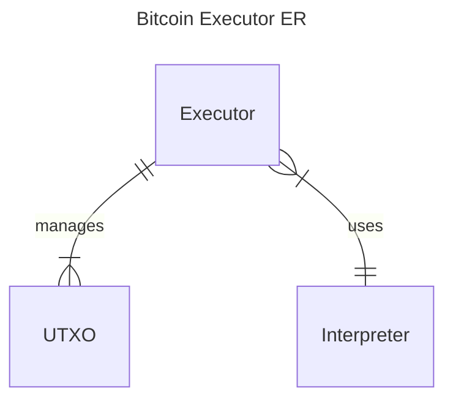
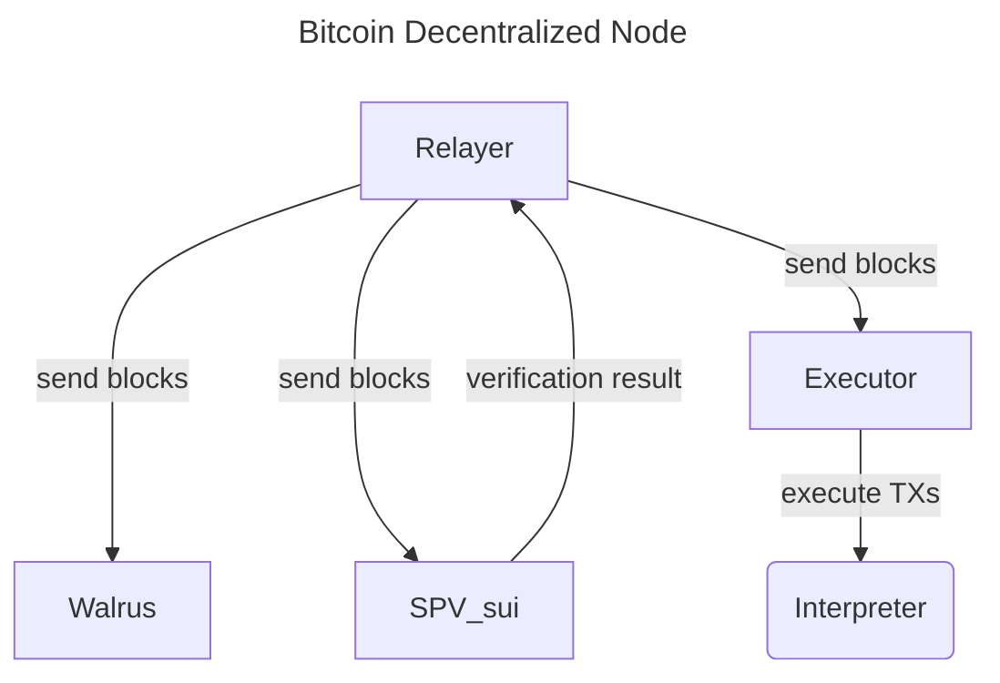
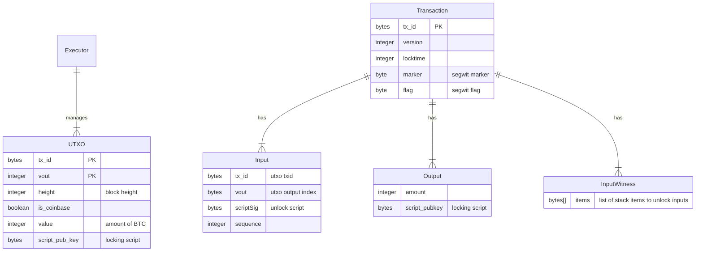

# Bitcoin Executor

Bitcoin execution node implementation powered by Sui smart contract.

This project is submitted to the [Kostas May Hackathon](https://x.com/kostascrypto/status/1918879265677819908)

## Architecture

1. Bitcoin [Relayer](https://github.com/gonative-cc/relayer/tree/master/bitcoinspv): Go service listening for new blocks, validating and sending to SPV, Walrus and Executor
2. Bitcoin [Executor](./) (this project): manages UTXO state and executes Bitcoin transactions.
3. [Walrus](https://www.walrus.xyz/): data availability for Bitcoin blocks.
4. Bitcoin [SPV](https://github.com/gonative-cc/move-bitcoin-spv/): light client validating Bitcoin block headers, checking proof of work and managing the heaviest chain.

### Bitcoin Executor

### Overall Architecture

## Flow

1. Relayer listens for _new blocks_.
2. Once a _new block_ arrives, Relayer validates it and checks if it's already processed. If not valid or already processed, `return`.
   - NOTE: Relayer has internal storage to handle reorgs and query Bitcoin nodes for missing blocks of the _current branch_.
3. Relayer sends block header (or a whole branch if reorg is detected) to SPV to validate if the branch makes a heaviest chain. If not, `return`.
4. Relayer sends new blocks of the extended branch (based on the SPV result) to Walrus for data availability.
5. Relayer sends new blocks to Executor.
6. Executor parses the block, `return` if encounter errors.
7. Executor extracts transactions and processes them. For each transaction:
   1. Checks if inputs are existing UTXOs
   2. For each input, call Interpreter to execute Bitcoin script.
   3. If Interpreter returns error (false), `return` and continue to the next transaction.
   4. Marks TX input UTXOs as spent.
   5. Add TX outputs to UTXO set.

## TODO

- SPV and Relayer handle reorgs, however the Executor doesn't handle reorgs
  - We need to update UTXO management to handle reorgs: add versioning and cleanups.
- Executor should use SPV to trustlessly verify blocks and independently handle reorgs.
- Currently we only support `Segwit` transactions. Other type of transactions have to be implemented: Taproot, Legacy (P2PK).

### Executor Entity Relationship

