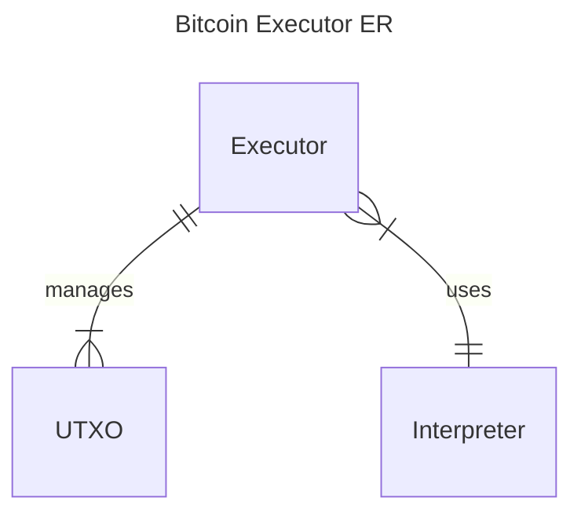
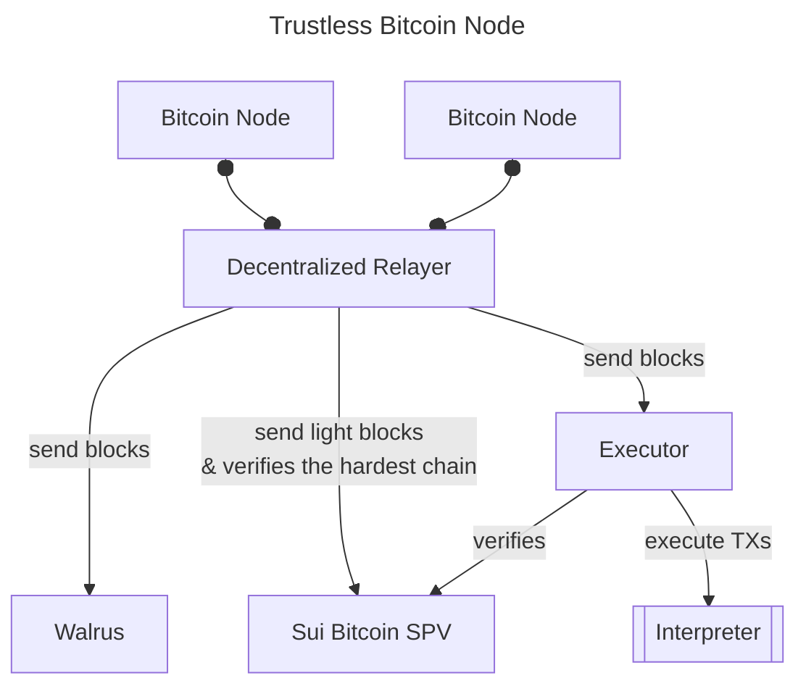
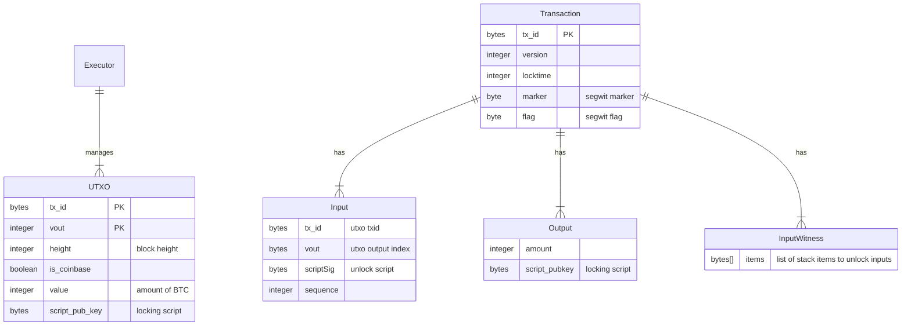

# Bitcoin Executor

Bitcoin Executor is set of Sui packages (smart contracts) to process Bitcoin blocks and execute Bitcoin transactions.

It's part of Bitcoin Execution Node powered by Sui and Walrus - it allows to trustlessly and permissionlessly execute Bitcoin on Sui. See Architecture section below for more details.

This project is submitted to the [Kostas May Hackathon](https://x.com/kostascrypto/status/1918879265677819908)

- [DEMO](./demo.md)

## Why Trustless Bitcoin Node is important?

Most of the users observe a state of a remote chain through a service providers. They need to trust the service providers and their API.
Wallets also have similar trust assumption - you have to trust the Wallet RPC providers.

Finally smart contracts on Sui don't have full access to Bitcoin state, which makes difficult to reason about Bitcoin state. This can be done with light clients (notably Natives' [Bitcoin SPV](https://github.com/gonative-cc/move-bitcoin-spv/). However, this requires indirect operations to access Bitcoin state: users / dapps need to send Bitcoin state with a proof rather than simply querying it on Sui.

Built on [**Native Zero Trust Architecture**](https://www.gonative.cc/post/trust-models-in-blockchain-architecture), and powered by [Ika](https://ika.xyz/) 2PC-MPC, Trustless Bitcoin Node provides:

- 👉 Full mirror the Bitcoin state on Sui
- 👉 Simulate Bitcoin transactions
- 👉 Grant Bitcoin users an access to Sui assets based on Bitcoin execution / state.
- 👉 Use advanced programmability patterns to execute native Bitcoin transactions.
- 👉 Compose multi contract calls based in Bitcoin state or TX result.
- 👉 Execute sophisticated flows, that include Bitcoin UTXOs.

📢 Thanks to Sui Network scalability and [Native](https://gonative.cc) tech, **Bitcoin finally is fully programmable and scalable!**

👉 You can trustlessly program and transfer access to Bitcoin assets!

This is **completely new paradigm**! The Zero Trust Architecture at it's best!

## Architecture

1. Bitcoin [Relayer](https://github.com/gonative-cc/relayer/tree/master/bitcoinspv): Go service listening for new blocks, validating and sending to SPV, Walrus and Executor
2. Bitcoin [Executor](./) (this project): manages UTXO state and executes Bitcoin transactions.
3. [Walrus](https://www.walrus.xyz/): data availability for Bitcoin blocks.
4. Bitcoin [SPV](https://github.com/gonative-cc/move-bitcoin-spv/): light client validating Bitcoin block headers, checking proof of work and managing the heaviest chain.

### Bitcoin Executor



### Overall Architecture



## Flow

1. Relayer listens for _new blocks_.
2. Once a _new block_ arrives, Relayer validates it and checks if it's already processed. If not valid or already processed, `abort`.
   - NOTE: Relayer has internal storage to handle reorgs and query Bitcoin nodes for missing blocks of the _current branch_.
3. Relayer sends block header (or a whole branch if reorg is detected) to SPV to validate if the branch makes a heaviest chain. If not, `abort`.
4. Relayer sends new blocks of the extended branch (based on the SPV result) to Walrus for data availability.
5. Relayer sends new blocks to Executor.
6. Executor parses the block, `abort` if encounter errors.
7. Executor extracts transactions and processes them. For each transaction:
   1. Checks if inputs are existing UTXOs
   2. For each input, call Interpreter to execute Bitcoin script.
   3. If Interpreter returns error (false), `continue` to the next transaction.
   4. Marks UTXOs of a successful TX as spent.
   5. Add outputs of a successful TX to UTXO set.

## TODO

Few things are missing to have a fully functioning trustless implementation of a Bitcoin Execution Node in Sui:

- SPV and Relayer handle reorgs, however the Executor doesn't handle reorgs yet.
  - We need to update UTXO management to handle reorgs: add versioning and cleanups.
- Executor should use SPV to trustlessly verify blocks and independently handle reorgs. We started the integration but didn't have time to test it and finish the setup.
- Bitcoin block size limit is 4MB. This is way more than a Sui TX size limit. We could split Block into multiple PTBs, but then we have another problem -- theoretically Bitcoin transaction size is the size of the block, and TXs have to be handled atomically and operate on an interpreter stack.
  - Today, the Bitcoin Executor is limited to handle blocks up to the Sui TX size limit.
  - We could use clever locking system to firstly propagate the interpreter stack, and then execute it.
- Currently we only support P2WPHK Segwit transactions. Other type of transactions have to be implemented: P2WSH, Taproot, Legacy (P2PK).

### Executor Entity Relationship



## Deployed smart contracts

- Env: Testnet
- Package ID: 0xb2d02e392491fc0ffe5216957518c536e426128cde6bcbd1fb56c714ab6edc2c
- Node Object (Bitcoin Executor): 0x9a44c39c79521d57dc338e3e2a2b851f42fcb6704dca94c8ea405274084c1f04

We have added the first two blocks from the BTC mainnet to the state object. The data in argument is block data in hex format. The sui transactions created by command below:

```bash
export P_ID=0xb2d02e392491fc0ffe5216957518c536e426128cde6bcbd1fb56c714ab6edc2c
export OBJ=0x9a44c39c79521d57dc338e3e2a2b851f42fcb6704dca94c8ea405274084c1f04
# genesis block
sui client call --function execute_block --module bitcoin_executor --package $P_ID --gas-budget 100000000 --args $OBJ 0x0100000000000000000000000000000000000000000000000000000000000000000000003ba3edfd7a7b12b27ac72c3e67768f617fc81bc3888a51323a9fb8aa4b1e5e4a29ab5f49ffff001d1dac2b7c0101000000010000000000000000000000000000000000000000000000000000000000000000ffffffff4d04ffff001d0104455468652054696d65732030332f4a616e2f32303039204368616e63656c6c6f72206f6e206272696e6b206f66207365636f6e64206261696c6f757420666f722062616e6b73ffffffff0100f2052a01000000434104678afdb0fe5548271967f1a67130b7105cd6a828e03909a67962e0ea1f61deb649f6bc3f4cef38c4f35504e51ec112de5c384df7ba0b8d578a4c702b6bf11d5fac00000000
# netblock
sui client call --function execute_block --module bitcoin_executor --package $P_ID --gas-budget 100000000 --args $OBJ 0x010000006fe28c0ab6f1b372c1a6a246ae63f74f931e8365e15a089c68d6190000000000982051fd1e4ba744bbbe680e1fee14677ba1a3c3540bf7b1cdb606e857233e0e61bc6649ffff001d01e362990101000000010000000000000000000000000000000000000000000000000000000000000000ffffffff0704ffff001d0104ffffffff0100f2052a0100000043410496b538e853519c726a2c91e61ec11600ae1390813a627c66fb8be7947be63c52da7589379515d4e0a604f8141781e62294721166bf621e73a82cbf2342c858eeac00000000
```

Transaciton details:

- https://suiscan.xyz/testnet/tx/E8iH6c5BxmSWUFmycicPc2ZNSLfg8DFhEjqE6cZfJwFu
- https://suiscan.xyz/testnet/tx/BmUeQzZ1XAhjXEKmAxCUEP9tFdVoDc77NSMWj1TTo2MR

## About Native

[Native](https://gonative.cc) is the most advanced Bitcoin interoperability protocol. Build on Zero Trust Architecture to enable BTCFi in a non-collusive, decentralized, trust-minimized way.

With us, you can program Bitcoin in the Web3 _native_ way!

Follow us on X: [@goNativeCC](https://x.com/goNativeCC).
