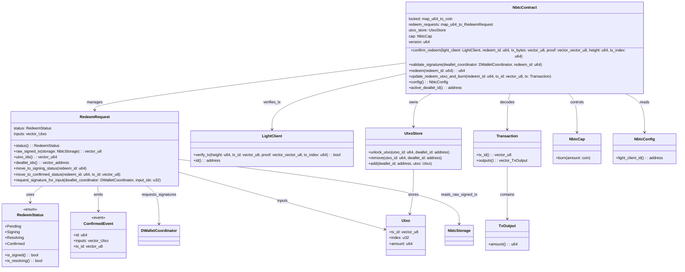

<!-- markdownlint-disable MD041 -->
<!-- markdownlint-disable MD034 -->

#  nBTC

`nBTC` is the synthetic BTC on Sui, redeemable 1-1 for BTC (on Bitcoin).

It's the first ever synthetic BTC that is

- fully permission-less,
- custody-less,
- keeps the true Web3 ethos.
- rightmost trust minimized (read about [nBTC trust model](https://x.com/goNativeCC/status/1899487861939806641))

## Deployed Contracts

For information on deployed packages and object IDs on testnet/mainnet, please see the main [README](../README.md#deployed-objects--packages) file.

## Package Functions

- `init`: Run once to set up the `nBTC` package, initializes the nBTC Coin type and the TreasuryCap object (`WrappedTreasuryCap`).
- `mint`: Takes Bitcoin transaction proof, verifies it using the SPV light client, and mints `nBTC` Coins.
- `redeem`: Takes `nBTC` Coins and destroys them. Note: NOT IMPLEMENTED!
- `total_supply`: Shows the total amount of `nBTC` currently in circulation.
- `get_light_client_id`: Shows the Object ID of the SPV light client.
- `get_fallback_address`: Shows the default Sui address used when `OP_RETURN` data isn't usable.

### Dependencies

- `bitcoin_spv`: An on-chain Bitcoin SPV light client for verifying Bitcoin transactions.
- `bitcoin_parser`: A library for parsing Bitcoin data structures (blocks, transactions).

## Documentation

- [nBTC Setup](./docs/nbtc_setup.md)
- [UTXO Management](./docs/utxo_management.md)
- [nBTC Minting Process](./docs/nbtc_minting.md)
- [nBTC Redeem Process](./docs/nbtc_redeem.md)

### Model

