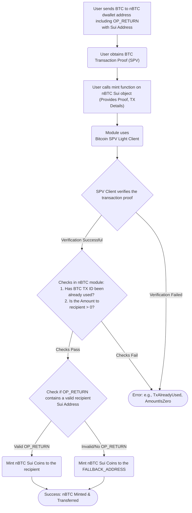

# nBTC

`nBTC` is the synthetic Bitcoin on Sui, redeemable 1-1 for BTC.

It's the first ever synthetic BTC (BTC that is represented on other chain) that is

- fully permissionless,
- custodyless,
- rightmost trust minimized (read about [nBTC trust model](https://x.com/goNativeCC/status/1899487861939806641))
- keeps the true Web3 ethos.

## How it Works

1.  A user sends BTC to to the `nBTC` dwallet address (on Bitcoin network). They include their target Sui address in the transaction's `OP_RETURN` field.
2.  The user calls the `mint` function of the `nBTC` Sui object, providing the BTC transaction details and the proof of the transaction. The proof is the traditional SPV Bitcoin proof.
3.  The `mint` function uses a configured Bitcoin SPV Light Client (identified by `LIGHT_CLIENT_ID`) to verify the transaction proof. It checks that BTC was sent to the correct `nBTC` dwallet address.
4.  Once the verification is successful and the BTC transaction hasn't been used before, the module mints the corresponding amount of `nBTC` Sui Coins.
5.  The new `nBTC` Coins are sent to the Sui address found in the `OP_RETURN` data, or to the `FALLBACK_ADDRESS` if the `OP_RETURN` data is missing or is invalid.

### Example

`sui client call --package 0x5419f6e223f18a9141e91a42286f2783eee27bf2667422c2100afc7b2296731b --module nbtc --function mint --args 0x47336d196275369fb52a200682a865a4bffdc9469d755d418d7e985c376ace35 0x4f989d395bb13b4913b483016641eb7c9cacfd88d2a1ba91523d0542a52af9e4 0x02000000 1 0x6541bc8d572ae0f7f8ac9b9bca552a46dc4d08f15ae36c77d2c62155280bfdeb0000000000fdffffff 3 0x3818000000000000160014ce9f3ad7d227c66e9744d052821c20d18a2ea78f7440000000000000160014781b0cd92c0e80a4e750377298088f485b0488440000000000000000226a20c76280db47f593b58118ac78c257f0bfa5bbfef6be2eff385f4e32a781f76945 0x00000000 ["0xde226d5af97afd52fe43e537c47f120a93f9fdfb105f138f1474fabbe2981627","0xc47bf897df6339821127e91e1d25fb4a978fce79f7e991a46ae743990f0baaf8","0x233bae6fdbdfba8333d2b669aad199dff0acd6e12c9a9d4418532440617fb0e7","0x1ed089632e4cdd6a59332fb5cde4623fa6b99b1fe75f934094e2bfbadb390903","0xc27f3f65f1a800c402714cb42d9ea88ecbb33a2a582357aaed7ccddd248e4ff7","0x6677179cd73d5a871a50d8c367eab417c2994b0c3b7edd6cecda7214946c51c8","0x684890fec2f023f7dcab4b8a0bcc602e684aaa4a7dbcbeeafb9cf3fa865cc96d","0x8a2dbae03754865f1494962014bcec88d33a1525d3c95831e05a95a1008773b0","0x11675fdff932f17a11efab6b68b1c962dff9fe6a5b48f22f69a07a4ce00fd021","0x597fa1ac0c53ca801614c92d63fd5af9ac79ec06ab3e74d53961c5981961930c","0xdf00775cc7cd94cce99db46fe8803fdc64120119959a3eb417f23f7991c672c6"] 76507 51 --gas-budget 100000000`

## Package Functions

- `init`: Run once to set up the `nBTC` package, initializes the nBTC Coin type and the TreasuryCap object (`WrappedTreasuryCap`).
- `mint`: Takes BTC transaction proof, verifies it using the SPV light client, and mints new `nBTC` Coins.
- `burn`: Takes `nBTC` Coins and destroys them. Note: NOT IMPLEMENTED!
- `total_supply`: Shows the total amount of `nBTC` currently in circulation.
- `get_light_client_id`: Shows the Object ID of the SPV light client.
- `get_fallback_address`: Shows the default Sui address used when `OP_RETURN` data isn't usable.

## Dependencies

- `bitcoin-spv`: This package relies on a Bitcoin SPV light client implementation for Sui to verify txs from Bitcoin https://github.com/gonative-cc/move-bitcoin-spv.

## Flowchart

