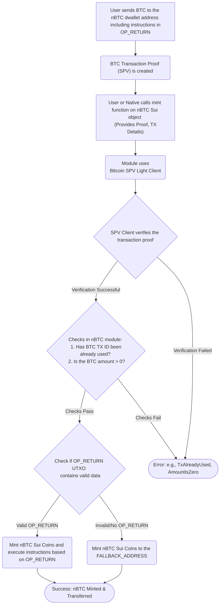
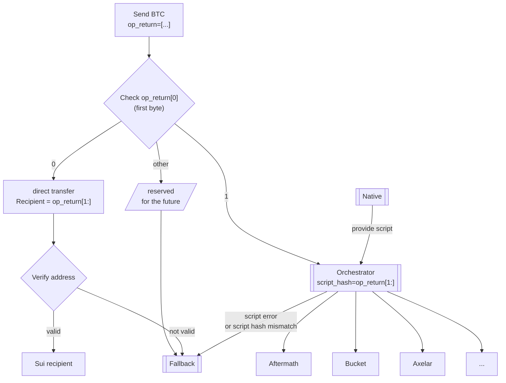

# nBTC Minting

## Minting nBTC process

1. A user sends BTC to the `nBTC` dwallet address (on Bitcoin network).
1. In the transaction, he must create an extra `OP_RETURN` vout (UTXO), where he puts the instructions (where to mint the nBTC and what to do with it).
1. Native system detects such transaction and calls the `mint` function of the `nBTC` Sui object, providing the BTC transfer details and the proof of the transaction and extra data provided by the user.
   - Note: the system is permissionless: anyone can handle the proof generation and calling mint function.
1. The nBTC module checks if the Bitcoin transaction was not already processed (To prevent double spends).
1. The `mint` function uses a configured Bitcoin SPV Light Client (identified by `LIGHT_CLIENT_ID`) to verify the transaction proof. It checks that BTC was sent to the correct `nBTC` dwallet address, using P2WPHK script with the correct amount, and the Bitcoin transaction contains UTXO with OP_RETURN.
1. Once the verification is successful and the BTC transaction hasn't been used before, the module mints the corresponding amount of `nBTC` Sui Coins.
1. The new `nBTC` Coins are sent to a Sui address or a package, based on the instruction in `OP_RETURN`.
1. If the `OP_RETURN` data is missing or is invalid, `nBTC` is sent to `FALLBACK_ADDRESS`.

### Flowchart: minting



## Handling nBTC after minting

nBTC package expects handling instructions in the OP_RETURN data. This is handled right after minting. It determines what to do with the newly minted `nBTC`.
The first byte of the OP_RETURN determines the type of the instructions (we use hex notation below):

- `0x00<recipient>`: simple transfer to a recipient. Right after the first byte (`0x00`), a valid Sui address is expected.
- `0x01<script_hash>`: Orchestrator. Right after `1` a hash of a script is expected. Full script must be provided to the user. Orchestrator will check if the script matches the recorded hash.
- Other values are reserved for the future versions of the protocol. Note: 2 could be zklogin instructions.

Today, only the simple transfer to a recipient is supported. Orchestrator will be implemented later.

### Flowchart: handling nBTC



## Example mint script

NOTE: we are working on a fullstack app to automate the minting process.

Use the `scripts/create_btc_mint_data.sh` script to extract the necessary transaction details and generate the Merkle proof required for verification on Sui. Provide the Bitcoin transaction ID (txid) as an argument to the script. The script gathers the following data needed for the `nbtc::mint` function:

- `version`: Transaction version.
- `input_count`: Number of transaction inputs.
- `inputs`: Raw transaction input data.
- `output_count`: Number of transaction outputs.
- `outputs`: Raw transaction output data.
- `lock_time`: Transaction lock time.
- `height`: The Bitcoin block height containing the transaction.
- `proof`: The Merkle proof branches.
- `tx_index`: The index of the transaction within the block.

Command:

```bash
# Replace with the actual Bitcoin transaction ID
TXID="897addd511f0a4c1ddc3dc3e9a14ba2174a6fa49388764db5bde4e946f8b8b1a"
bash scripts/create_btc_mint_data.sh ${TXID}
```

Example Output:

```json
{
  "version": "0x02000000",
  "input_count": 1,
  "inputs": "0x6541bc8d572ae0f7f8ac9b9bca552a46dc4d08f15ae36c77d2c62155280bfdeb0000000000fdffffff",
  "output_count": 3,
  "outputs": "0x3818000000000000160014ce9f3ad7d227c66e9744d052821c20d18a2ea78f7440000000000000160014781b0cd92c0e80a4e750377298088f485b0488440000000000000000226a20c76280db47f593b58118ac78c257f0bfa5bbfef6be2eff385f4e32a781f76945",
  "lock_time": "0x00000000",
  "height": 76507,
  "proof": [
    "0xde226d5af97afd52fe43e537c47f120a93f9fdfb105f138f1474fabbe2981627",
    "0xc47bf897df6339821127e91e1d25fb4a978fce79f7e991a46ae743990f0baaf8",
    "0x233bae6fdbdfba8333d2b669aad199dff0acd6e12c9a9d4418532440617fb0e7",
    "0x1ed089632e4cdd6a59332fb5cde4623fa6b99b1fe75f934094e2bfbadb390903",
    "0xc27f3f65f1a800c402714cb42d9ea88ecbb33a2a582357aaed7ccddd248e4ff7",
    "0x6677179cd73d5a871a50d8c367eab417c2994b0c3b7edd6cecda7214946c51c8",
    "0x684890fec2f023f7dcab4b8a0bcc602e684aaa4a7dbcbeeafb9cf3fa865cc96d",
    "0x8a2dbae03754865f1494962014bcec88d33a1525d3c95831e05a95a1008773b0",
    "0x11675fdff932f17a11efab6b68b1c962dff9fe6a5b48f22f69a07a4ce00fd021",
    "0x597fa1ac0c53ca801614c92d63fd5af9ac79ec06ab3e74d53961c5981961930c",
    "0xdf00775cc7cd94cce99db46fe8803fdc64120119959a3eb417f23f7991c672c6"
  ],
  "tx_index": 51
}
```

Use the extracted data to call the `nbtc::mint` function. Command:

```bash
sui client call --package 0x5419f6e223f18a9141e91a42286f2783eee27bf2667422c2100afc7b2296731b \
    --module nbtc \
    --function mint \
    --args 0x47336d196275369fb52a200682a865a4bffdc9469d755d418d7e985c376ace35 \
            0x4f989d395bb13b4913b483016641eb7c9cacfd88d2a1ba91523d0542a52af9e4 \
            0x02000000 \
            1 \
            0x6541bc8d572ae0f7f8ac9b9bca552a46dc4d08f15ae36c77d2c62155280bfdeb0000000000fdffffff \
            3 \
            0x3818000000000000160014ce9f3ad7d227c66e9744d052821c20d18a2ea78f7440000000000000160014781b0cd92c0e80a4e750377298088f485b0488440000000000000000226a20c76280db47f593b58118ac78c257f0bfa5bbfef6be2eff385f4e32a781f76945 \
            0x00000000 \
             '['"0xde226d5af97afd52fe43e537c47f120a93f9fdfb105f138f1474fabbe2981627"','"0xc47bf897df6339821127e91e1d25fb4a978fce79f7e991a46ae743990f0baaf8"','"0x233bae6fdbdfba8333d2b669aad199dff0acd6e12c9a9d4418532440617fb0e7"','"0x1ed089632e4cdd6a59332fb5cde4623fa6b99b1fe75f934094e2bfbadb390903"','"0xc27f3f65f1a800c402714cb42d9ea88ecbb33a2a582357aaed7ccddd248e4ff7"','"0x6677179cd73d5a871a50d8c367eab417c2994b0c3b7edd6cecda7214946c51c8"','"0x684890fec2f023f7dcab4b8a0bcc602e684aaa4a7dbcbeeafb9cf3fa865cc96d"','"0x8a2dbae03754865f1494962014bcec88d33a1525d3c95831e05a95a1008773b0"','"0x11675fdff932f17a11efab6b68b1c962dff9fe6a5b48f22f69a07a4ce00fd021"','"0x597fa1ac0c53ca801614c92d63fd5af9ac79ec06ab3e74d53961c5981961930c"','"0xdf00775cc7cd94cce99db46fe8803fdc64120119959a3eb417f23f7991c672c6"']' \
            76507 \
            51 \
    --gas-budget 100000000
```
