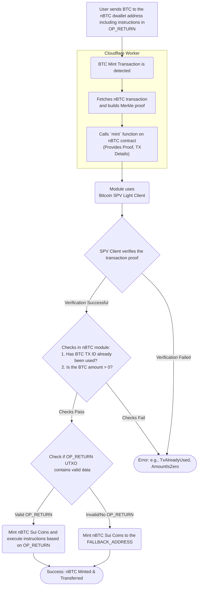
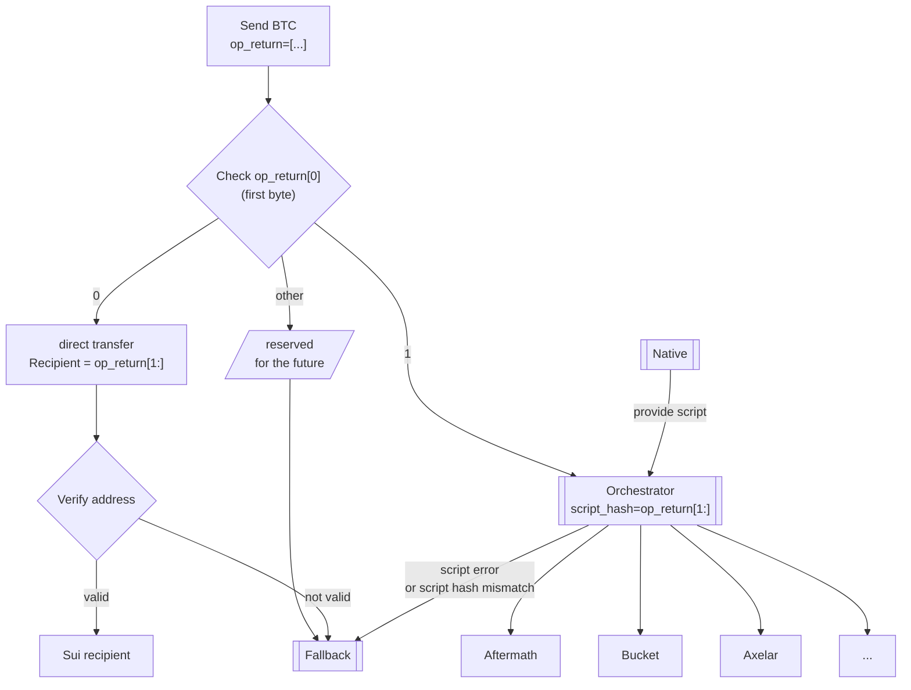
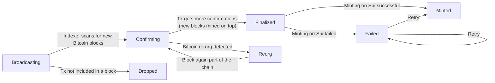

# nBTC Minting

## Definitions

- dwallet: Ika dwallet. In the context of nBTC, this is the `contract` that holds the Bitcoin. [see more](https://github.com/dwallet-labs/ika/blob/main/docs/docs/core-concepts/dwallets.md)
- spend_key: The public key script (`scriptPubKey`) for the dwallet address.

## Minting nBTC process

1. A user sends BTC to the `nBTC` dwallet address (on the Bitcoin network).
1. In the transaction, he must create an extra `OP_RETURN` output (UTXO), where he puts the instructions (where to mint the nBTC and what to do with it). If a transaction has multiple OP_RETURN outputs, we select the first OP_RETURN for the minting process.
1. The Native system detects such a transaction and calls the `mint` function of the `nBTC` Sui object, providing the BTC transfer details and the proof of the transaction, and extra data provided by the user.
   - Note: the system is permissionless: anyone can handle the proof generation and call the mint function.
1. The nBTC module checks if the Bitcoin transaction was not already processed (To prevent double-spends).
1. The `mint` function uses a configured Bitcoin SPV Light Client (identified by `LIGHT_CLIENT_ID`) to verify the transaction's inclusion in a block. It then finds the total amount sent to the `spend_key` (dwallet) registered in the contract by performing a comparison on the transaction's outputs.
1. Once the verification is successful and the BTC transaction hasn't been used before, the module mints the corresponding amount of `nBTC` Sui Coins.
1. The new `nBTC` Coins are sent to a Sui address or a package, based on the instruction in `OP_RETURN`.
1. If the `OP_RETURN` data is missing or is invalid, `nBTC` is sent to `FALLBACK_ADDRESS`.

### Flowchart: minting



## Handling nBTC after minting
The nBTC package expects handling instructions in the OP_RETURN data. This is handled right after minting to determine what to do with the newly minted `nBTC`.
The first byte of the OP_RETURN data is the `payload_type`, which dictates how the rest of the data is interpreted:

- `0x00<recipient>`: Direct Transfer. The contract expects the rest of the `OP_RETURN` data to be _exactly_ 32 bytes representing the recipient's Sui address. If the data is not 32 bytes long, the mint will be sent to the contract's `fallback_addr` instead.
- `0x01<script_hash>`: Orchestrator. This type expects a hash of a script. The full script must be provided by the user. Orchestrator will check if the script matches the recorded hash.
- Other values are reserved for future versions of the protocol. Note: 2 could be zklogin instructions.

Today, only the simple transfer to a recipient is supported. Orchestrator will be implemented later.

### Flowchart: handling nBTC



## Minting Fees

The `mint` function includes a mechanism for applying a minting fee. This is controlled by the `ops_arg` parameter.

- **`ops_arg=0`**: No fee is applied. The full amount of minted nBTC is transferred to the recipient.
- **`ops_arg=1`**: The minting fee is applied. The constant `MINT_OP_APPLY_FEE` is set to `1` for this purpose.

The fee is calculated as `min(amount, contract.mint_fee)`, where `amount` is the value of the Bitcoin deposit and `mint_fee` is a value configured in the `nBTCContract` by the admin. The fee is then deducted from the minted nBTC, and the remainder is transferred to the recipient. The collected fees are stored in the contract and can be withdrawn by the operator.

## Tx Status Transition Diagram

The system that automates the whole process assigns statuses in the following manner:



## Example mint script

NOTE: We are working on a full-stack app to automate the minting process.

To call the `mint` function, you first need to acquire several arguments from the Bitcoin blockchain related to your deposit transaction. A helper script like `scripts/create_btc_mint_data.sh` can be used to gather this data. You must provide the Bitcoin transaction ID (txid) to the script.

**Required Arguments:**

- `tx_bytes`: The raw, hex-encoded Bitcoin transaction.
- `height`: The Bitcoin block height containing the transaction.
- `proof`: The Merkle proof branches for the transaction's inclusion in the block.
- `tx_index`: The index of the transaction within the block.

**Conceptual `sui client call`:**

Once you have the arguments, you can construct the call to the `mint` function. The example below shows the structure of the command.

```bash
# Example arguments. Use the actual output from your helper script.
CONTRACT_ID="0x..."
LIGHT_CLIENT_ID="0x..."
TX_BYTES="0x0100..."
PROOF='["0x...", "0x..."]'
HEIGHT=12345
TX_INDEX=42
# ops_arg: 1 to apply fees, 0 to skip
OPS_ARG=1

sui client call --package <YOUR_NBTC_PACKAGE_ID> \
    --module nbtc \
    --function mint \
    --args ${CONTRACT_ID} \
           ${LIGHT_CLIENT_ID} \
           ${TX_BYTES} \
           ${PROOF} \
           ${HEIGHT} \
           ${TX_INDEX} \
           "[]" \
           ${OPS_ARG} \
    --gas-budget 100000000
```
