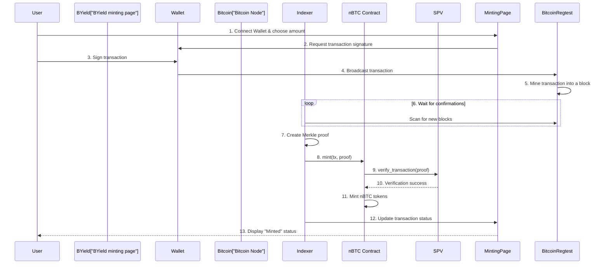

# nBTC Testnet V2 Setup

## Overview

The Testnet V2 setup is designed to provide a simplified testing environment for nBTC. It consists of packages deployed on the Sui Testnet that interact with our private Bitcoin devnet.

For this setup we use our own Bitcoin devnet because
- ... list ux and devx issues of the Bitcoin testnet

Key characteristics:

- Sui Network: testnet.
- Bitcoin Network: 
  - block time: 2min, 
  - required confirmations: 4 - so time to finality is 8min.
- wallet integration: through our private Bitcoin node, details in the [byield](https://byield.gonative.cc/) UI.

## Minting Flow

### Components

- Sui Packages:
  - `btc_parser`: A library for parsing Bitcoin transaction and block data structures.
  - `bitcoin_spv`: A Bitcoin SPV (Simple Payment Verification) light client that verifies Bitcoin transaction inclusion in a block.
  - `nBTC`: The core package that manages the minting and wrapping of nBTC tokens.
- Bitcoin Regtest Network: A private, single-node Bitcoin network configured for a 2-minute block time.
- Relayer: An off-chain service that monitors the Bitcoin network for new blocks and submits them to the `bitcoin_spv` light client on Sui and to the cloudflare indexer.
- Indexer: An off-chain service that indexes Bitcoin transaction data and provides merkle proofs required for minting.
- Minting UI: A web page that allows users to initiate nBTC mints. It is integrated with the Xverse wallet.

## Deployed Packages & Objects (Sui Testnet)

### Packages

- `btc_parser` Package ID: `0x067b7de3c12da30d718b8fef183c7d4ccce5689bebbe771def42c17c69801f4d`
- `bitcoin_spv` (Light Client) Package ID: `0x9010405a2de729a8a2578ab78b061591dc6f637cca16fd17d84242fd6d485a6d`
- `nBTC` Package ID: `0x50be08b805766cc1a2901b925d3fb80b6362fcb25f269cb78067429237e222ec`

### Objects

- `bitcoin_spv` Light Client Object ID: `0x74d82b7df244d578e6a71a57e84081e8a1050df5214e0f97870a8d9d486810a7`
- `nBTC::contract` Object ID: `0x5905e0c452bb5f237fb106ec2ecff962fbc60cd180090fb07a79d14d9d628a96`

### Deployment Details

- `nBTC` Deployment Transaction Digest: `AxGHZwZ9xx4UzQ1oxgKshm7USRfyMfwiYoFTyyVm7aT8`

## Bitcoin Configuration (Regtest)

- Deposit Address: `bcrt1q90xm34jqm0kcpfclkdmn868rw6vcv9fzvfg6p6`

This address is the destination for Bitcoin deposits that are used to mint nBTC.
